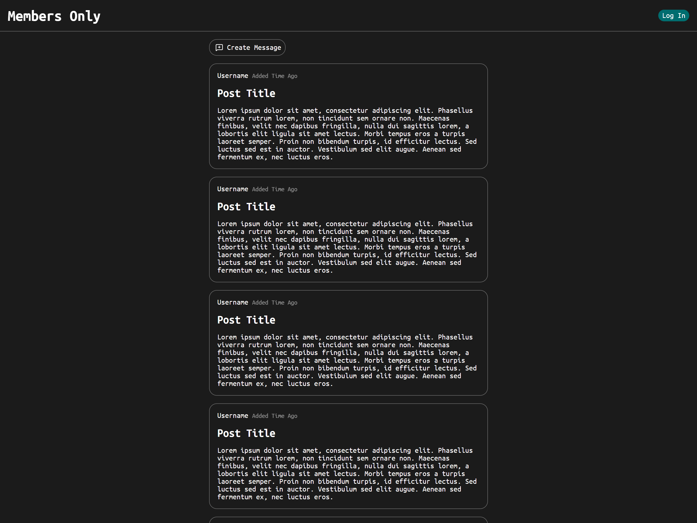

# Members Only

This is a message board application where anyone can read messages, but only
members can create new ones. Membership is granted through sign-up with a
passcode, and users with the correct admin passcode can delete messages. Members
who provide the correct membership passcode can also view additional details
like the author's name and the time since the message was posted.



## Built With

- **Node.js** with **Express** for the server-side framework
- **EJS** as the templating engine
- **Passport.js** for session-based authentication
- **bcrypt** for securely hashing and verifying passwords
- **PostgreSQL** for the database
- **Railway** for deployment

## Live Demo

[Live version of the app on Railway](https://members-only-production-a260.up.railway.app/)

## Installation

Follow these steps to get the app running locally:

1. **Clone the Repository**:

   ```bash
   git clone https://github.com/ZohairGandhi/members-only.git
   cd members-only
   ```

2. **Install Dependencies**:

   ```bash
   npm install
   ```

3. **Set Up PostgreSQL** Make sure you have PostgreSQL installed and running on
   your local machine. Create a new database to store your data.

4. **Create Environment Variables** You’ll need to create a `.env` file in the
   root of the project with the following variables:

   ```plaintext
   PGUSER=your_pg_username
   PGPASSWORD=your_pg_password
   PGDATABASE=your_database_name
   SESSION_SECRET=your_session_secret
   MEMBERSHIP_PASS=your_membership_passcode
   ADMIN_PASS=your_admin_passcode
   ```

5. **Populate the Database** After setting up the PostgreSQL database and
   environment variables, run the `populatedb.js` script to create the necessary
   tables:

   ```bash
   node db/populatedb.js
   ```

6. **Run the Application**:

   ```bash
   node app.js
   ```

   Your app should now be running locally on
   [http://localhost:3000](http://localhost:3000).
